<div align="center">


<br>

# <b>CODA</b> MUSIC

<p>
  <span></span>
</p>

<br>

<a href="https://github.com/coder-nishanth/coda-music/releases" target="_blank"></a>
<a href="https://flutter.dev" target="_blank"></a>
<a href="https://CodaMusic.onrender.com" target="_blank"></a>
<a href="https://github.com/coder-nishanth/coda-music/blob/main/LICENSE" target="_blank"></a>

<br>

<a href="https://CodaMusic.onrender.com" target="_blank"></a>
<a href="https://buymeacoffee.com/coder.nishanth" target="_blank"></a>

</div>

---

<br>

## 🎧 What is CODA MUSIC?

**CODA MUSIC** is a desktop music player built with Flutter that brings together
streaming, local playback, lyrics, and chart discovery — all in one beautiful app.

<br>

---

## 📸 Screenshots

<div align="center">
  <table>
    <tr>
      <td>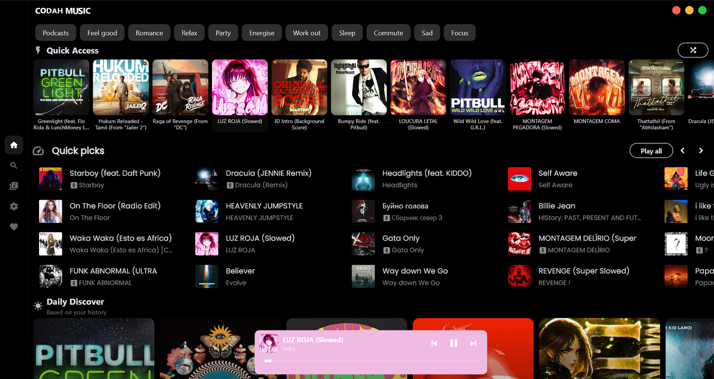</td>
      <td>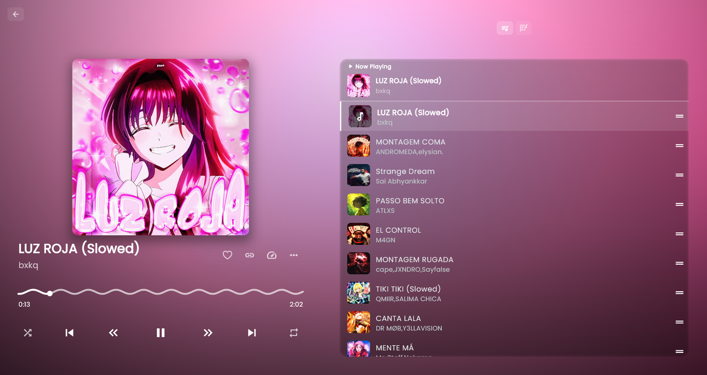</td>
    </tr>
    <tr>
      <td>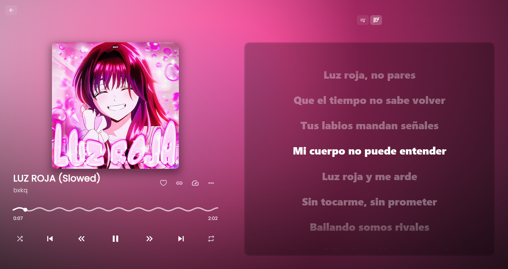</td>
      <td>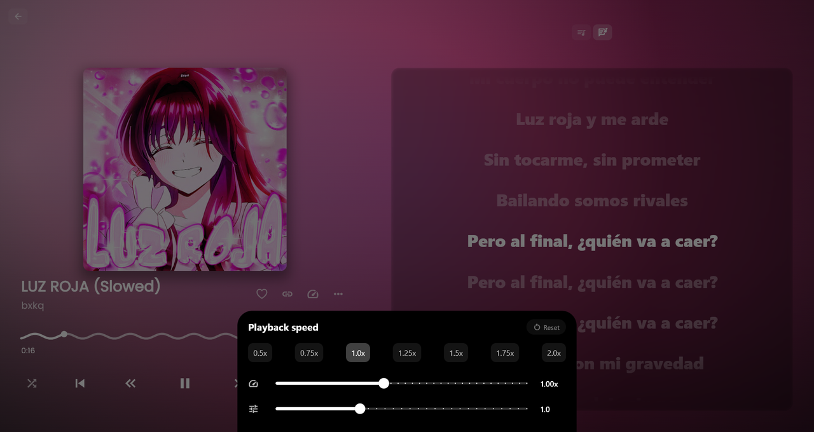</td>
    </tr>
    <tr>
      <td>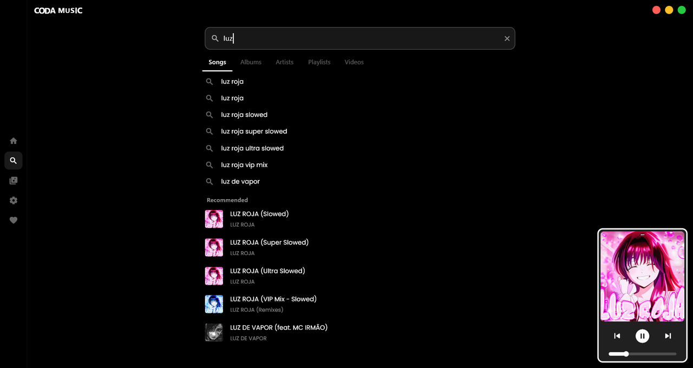</td>
      <td>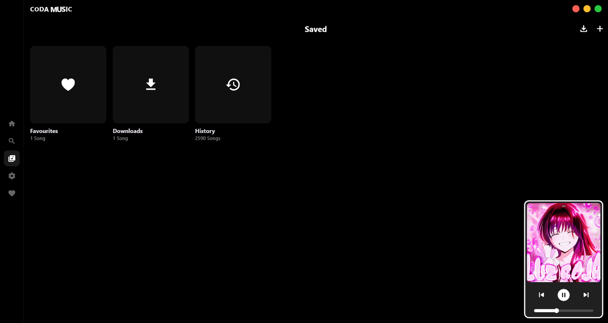</td>
    </tr>
    <tr>
      <td>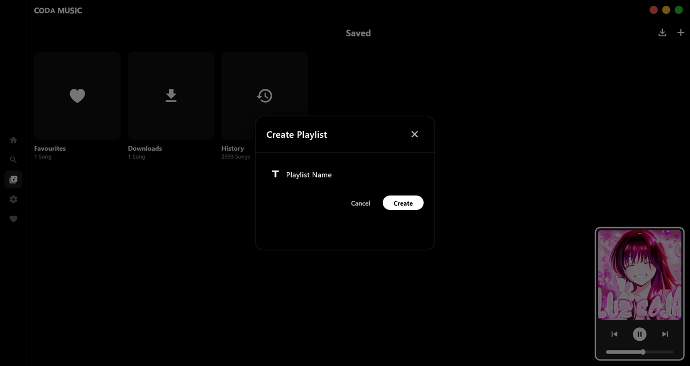</td>
      <td>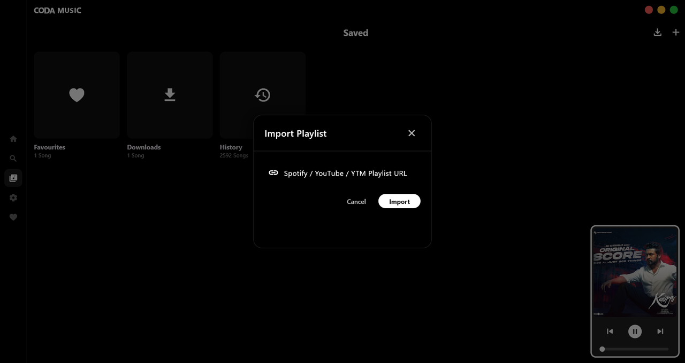</td>
    </tr>
    <tr>
      <td>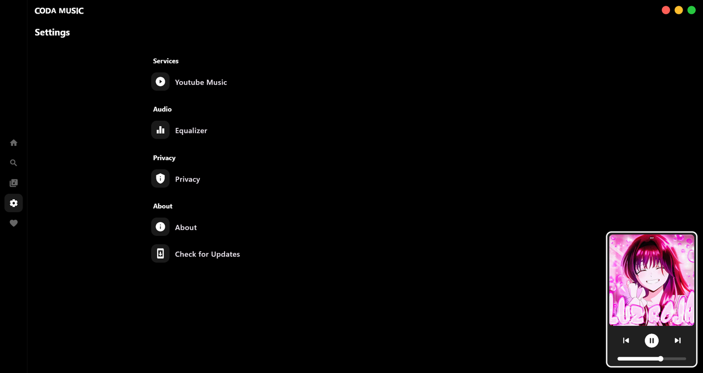</td>
      <td>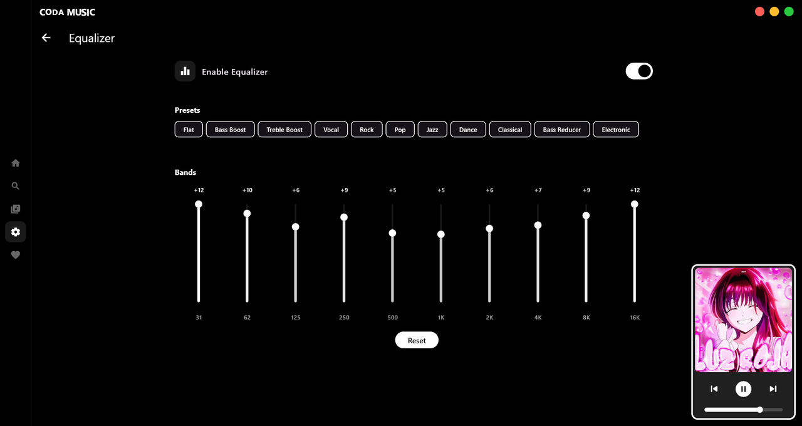</td>
    </tr>
    <tr>
      <td>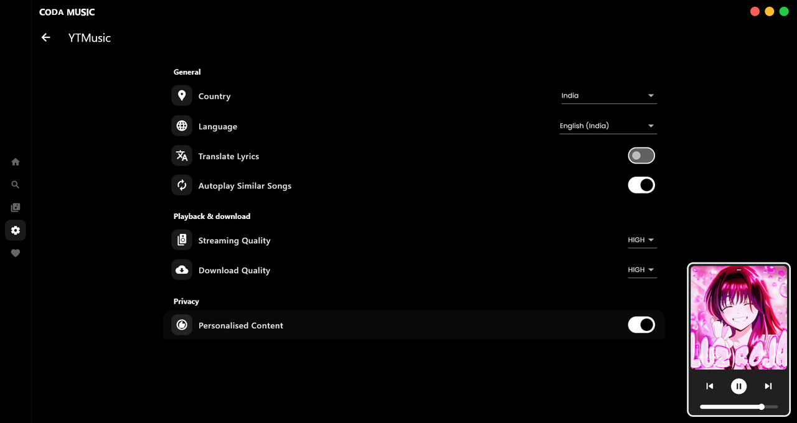</td>
      <td>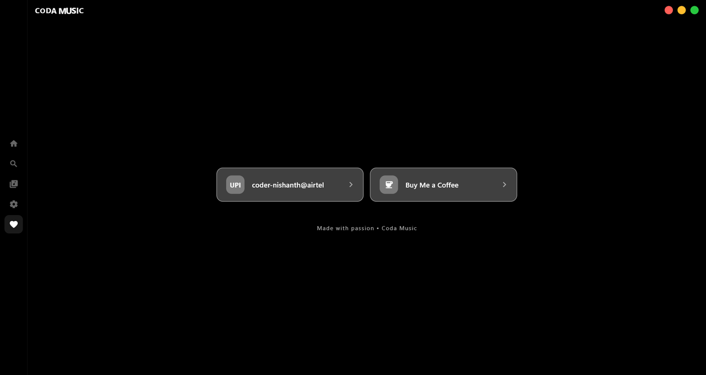</td>
    </tr>
  </table>
</div>

<br>

---

## :rocket: Quick Start

```bash
# Clone
git clone https://github.com/coder-nishanth/coda-music.git
cd coda-music

# Install & Run
flutter pub get
flutter run
```

### Build Release

```bash
flutter build windows --release
```

Output: `build/windows/x64/runner/Release/coda-music.exe`

<br>

---

## :shield: Windows SmartScreen Notice

When running the app for the first time, Windows SmartScreen may show a warning.

**To bypass:**
1. Click **"More info"**
2. Click **"Run anyway"**

<br>

---

## :heart: Thanks

Inspiration and ideas from:

- **Simpmusic** — music streaming concepts
- **Echo Music** — UI and player design ideas
- **Metrolist** — UI components and design patterns

<br>

---

<div align="center">

**Made with :blue_heart: and Flutter**

</div>
